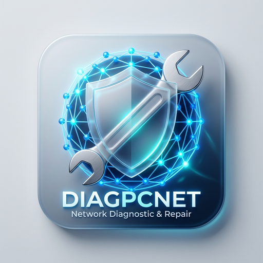

# DiagPcNet - Windows Network Sharing Repair Tool
<p align="center">
  
</p>

Outil de diagnostic et réparation automatique des problèmes de partage réseau sous Windows 10/11.

## Fonctionnalités
- Vérification du profil réseau (Public vs Privé)
- Diagnostic des services critiques (LanmanServer, fdPHost, etc.)
- Vérification des règles Firewall
- Correction du registre (Guest Authentication)
- Reset de la stack IP et Winsock
- Flush DNS et NetBIOS

## Installation
Nécessite Python 3.10+.
Aucune dépendance externe (utilise la bibliothèque standard et PowerShell).

```bash
# Pas de pip install nécessaire
python main.py
```

## Compilation en EXE
Pour générer un exécutable autonome :

```bash
pip install pyinstaller
pyinstaller --onefile --noconsole --name "DiagPcNet" --admin main.py
```
*Note : Le flag `--admin` (ou via manifest) est crucial car l'outil manipule des services système.*

## Utilisation
1. Lancez l'application (elle demandera les droits administrateur).
2. Cliquez sur **Analyser**.
3. Si des erreurs apparaissent, cliquez sur **Réparer**.
4. Redémarrez si nécessaire.

